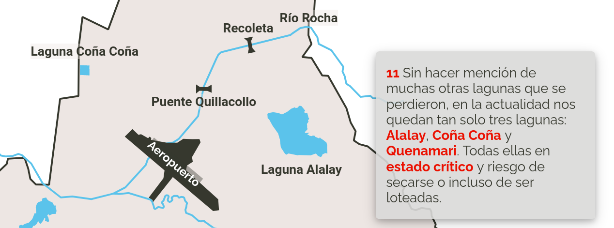

# Cochabamba Lakes



Website presentation of dried up lakes in the city of Cochabamba, Bolivia.

:pushpin: [Access presentation](https://onestepcode.com/cocha-lakes/index.html)

## Features

- Geographically accurate SVG maps.
- SVG animations using [anime js](https://animejs.com/), involving zoom and pan effects.
- Animations triggered as user scrolls up/down.

## Set up

To access the presentation locally, clone repo and build.

```sh
$ npm install
$ npm run build
```

Minified `js` and `css` files will be generated.

Then, open `src/index.html` on your preferred web browser.

## Inspiration

The idea of making a map-based presentation was obtained from the NY Times _[How the virus won](https://www.nytimes.com/interactive/2020/us/coronavirus-spread.html)_ article.

## Sources

Icons made by [Freepick](https://www.freepik.com), [Pixel Buddha](https://www.flaticon.com/authors/pixel-buddha), and [Pixel Perfect](https://www.flaticon.com/authors/pixel-perfect) from [www.flaticon.com](https://www.flaticon.com/).

## License

GPL 3.0.
